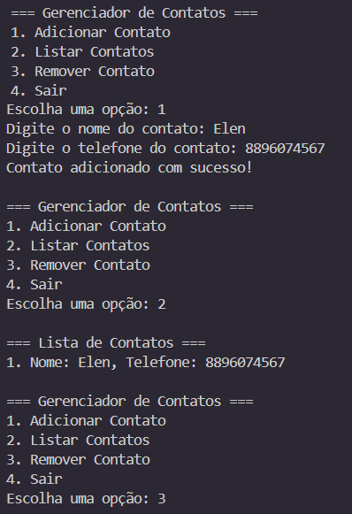

# ⋅˚₊‧ ୨୧ ‧₊˚ ⋅📇 Gerenciador de Contatos Simples em Ruby

Este é um projeto simples em Ruby que permite ao usuário gerenciar uma lista de contatos diretamente pelo terminal. Com ele, você pode adicionar, visualizar e remover contatos de maneira fácil e rápida.

## ˙✧˖°📷 ༘ ⋆｡˚ Screenshots

## ⋆⭒˚.⋆🛠️ Funcionalidades

- Adicionar contatos com nome e telefone
- Listar todos os contatos cadastrados
- Remover um contato específico da lista
- Interface simples em linha de comando (CLI)

## ⋆౨ৎ˚⟡˖ ࣪▶️ Como usar

1. **Clone este repositório (opcional):**
   git clone https://github.com/seu-usuario/gerenciador-contatos-ruby.git
   cd gerenciador-contatos-ruby
   
2. Execute o programa:
ruby gerenciador_contatos.rb

3. Use o menu interativo:

1 para adicionar um contato

2 para listar os contatos existentes

3 para remover um contato

4 para sair do programa

## . ₊ ⊹ . ₊˖💡 Exemplo de uso

=== Gerenciador de Contatos ===
1. Adicionar Contato
2. Listar Contatos
3. Remover Contato
4. Sair
Escolha uma opção: 1

Digite o nome do contato: Ana

Digite o telefone do contato: 99999-9999

Contato adicionado com sucesso!

## ──★˙🍓̟!! Requisitos
Ruby instalado (versão 2.5 ou superior recomendada)

## 🎸⋆⭒˚｡⋆ Autora

Feito com ❤️ por Mary.
